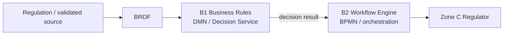

# OSS v2 Business Rules PoC Architecture

## Logical placement

## Responsibility boundary

### B1 — Business Rules

- regulatory rule repository
- BRDF canonical representation
- DMN / decision table
- rule evaluation
- version metadata
- decision trace / explainability
- output contract for B2

### B2 — Workflow Engine

- BPMN process instance
- routing based on B1 result
- user/service task
- SLA timer
- event/message handling
- retry and compensation
- process audit trail

B2 **tidak perlu menduplikasi** decision logic KBLI di gateway BPMN.

## PoC flow

1. Client mengirim input KBLI, ruang lingkup, skala usaha, dan parameter.
2. B1 mengevaluasi decision table `permit-profile`.
3. B1 menghasilkan `riskLevel`, `permitType`, `authority`, `slaDays`, dan `routeTarget`.
4. B2 mengonsumsi decision result sebagai process variables.
5. B2 melakukan routing ke domain regulator terkait.
6. PoC menghasilkan trace agar rule yang menghasilkan keputusan dapat ditelusuri.

## Production evolution

PoC menggunakan in-memory rule catalog. Target production dapat menggantinya dengan:

- Git-backed BRDF repository + approval workflow,
- PostgreSQL/Document DB untuk rule registry,
- DMN engine (mis. engine yang mendukung DMN 1.x),
- rule lifecycle `DRAFT -> REVIEW -> APPROVED -> ACTIVE -> RETIRED`,
- effective date dan historical version lookup,
- digital approval/signing untuk publication rule,
- integration contract ke B2 Workflow Engine.
